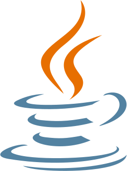
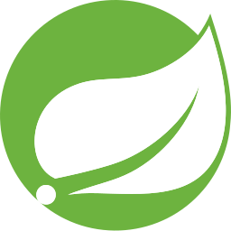
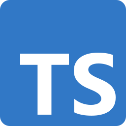
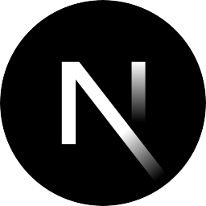
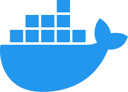

  

## Hi there! My name is Enoughy 

###  About Me
- 💻 Full-Stack Developer
- 🔭 Currently working on web applications and pet projects
- 🌱 Improving my skills in software architecture and cloud technologies
- ⚡ Interested in backend development, frontend development, and clean cod

### Program languages and technologies that I use:

  
  &nbsp;&nbsp;
  
  &nbsp;&nbsp;  
  
  &nbsp;&nbsp;
  
  &nbsp;&nbsp;
  
  &nbsp;&nbsp;
  
  &nbsp;&nbsp;
  
  &nbsp;&nbsp;
  

<!--
**enoughy/enoughy** is a ✨ _special_ ✨ repository because its `README.md` (this file) appears on your GitHub profile.

Here are some ideas to get you started:

- 🔭 I’m currently working on ...
- 🌱 I’m currently learning ...
- 👯 I’m looking to collaborate on ...
- 🤔 I’m looking for help with ...
- 💬 Ask me about ...
- 📫 How to reach me: ...
- 😄 Pronouns: ...
- ⚡ Fun fact: ...
-->
